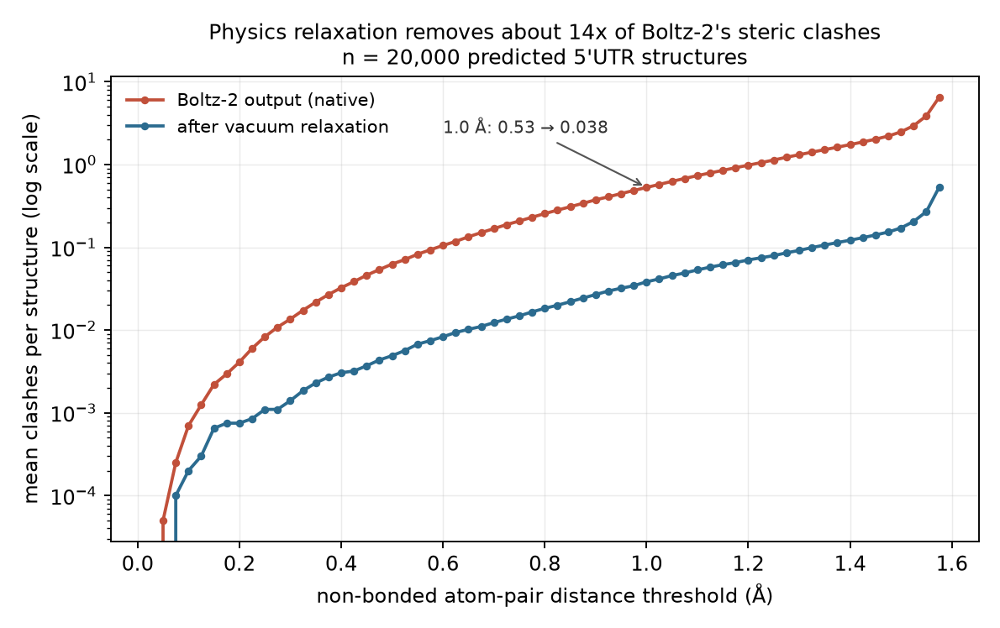

# Boltz-2 RNA Energetics Pipeline

**Do the structures a folding model predicts carry real physics, or do they just
look like structures?**

This came out of work on physics-informed models for RNA design. Models built on
Boltz-2 embeddings beat sequence-only models in low-data regimes, which matters
because the training sets behind production mRNA potency models cost on the order
of a million dollars each and do not transfer cleanly to a new therapeutic. Nobody
could say which physical priors were doing the work.

So: fold 20,000 5'UTRs with Boltz-2, relax them under a force field, and ask what
the physics says about the raw predictions and about translation.

Energetics and interpretability analysis built under **Dr. Daniel Mukasa**, toward a
Boltz-2-based generative model for 5'UTR design. Dataset is **egfp_unmod_1** from
Sample et al. 2019.

## Result 1: the raw structures are not physically valid, and relaxation fixes that

This is the main finding. Counting non-bonded heavy-atom pairs closer than a given
distance, across all 20,000 structures, before and after vacuum relaxation:

| threshold | clashes per structure, Boltz-2 output | after relaxation | structures with any clash, before | after |
|---|---|---|---|---|
| 0.75 Å | 0.208 | 0.015 | 16.5% | 1.1% |
| 1.00 Å | 0.529 | 0.038 | 31.6% | 2.1% |
| 1.25 Å | 1.135 | 0.079 | 48.9% | 3.1% |
| 1.50 Å | 2.484 | 0.171 | 72.4% | 4.7% |



The reduction stays between **12x and 14.5x** across the whole sweep from 0.5 to
1.575 Å, stable enough to be a property of the model's output rather than of the
threshold. Nearly a third of raw predictions contain at least one sub-Ångström
non-bonded contact.

Full sweep of 64 thresholds in `clash_summary.csv`, produced by `count_clashes.py`.

**One honest caveat on the metric.** At the top of the sweep the count stops being a
clash count. At 1.6 Å the ordering inverts, 19.0 native against 40.5 relaxed, because
at that distance you start counting ordinary 1-3 covalent geometry, and relaxed
structures have tighter idealised bond geometry than raw predictions do. Everything
at or below 1.575 Å is a clash count. The 1.6 Å row is in the CSV and should not be
read as a clash result.

## Result 2: relaxed energy predicts translation, weakly, and only after two controls

On egfp_unmod_1, relaxed structural energy is a weak but highly significant predictor
of ribosomal load, but only once AUG-containing 5'UTRs are excluded.

- Across all sequences the relationship is absent. Pearson **r = -0.001, p = 0.85, n = 19,999**
  (`rl_E_relaxed_pairs.csv`).
- Excluding 5'UTRs that contain an AUG, whose upstream start codons tend to dominate
  translation and mask any structural signal, leaves 6,013 of 20,000 sequences. That
  set alone still shows nothing: **r = 0.009, p = 0.49**.
- Removing energy outliers by the Tukey IQR rule from that set leaves **n = 5,552**,
  and the correlation appears: **Pearson r = 0.196, p = 4.1 × 10⁻⁴⁹**, Spearman
  rho = 0.240, **r² = 0.038**.

So the effect is real and directional, but small. Relaxed energy explains under 4% of
the variance in ribosomal load, and it takes both filters to see it at all. The
methodological point is the more interesting one: the relationship is invisible until
you control for AUG content, and that exclusion is part of the finding, not a
footnote.

`rl_vs_E_sequences.csv` holds the model, sequence, ribosomal load and relaxed energy
for all 6,013 AUG-free sequences, so the headline number can be reproduced without
rerunning the pipeline.


> **Correction, September 2026.** An earlier version of this README reported the
> AUG-excluded correlation at n ≈ 18k. That number was the IQR-filtered size of the
> *full* set (18,393), carried over to the wrong row. The correct n is **5,552**. The
> r and p values were right, and the quoted p of 4.1 × 10⁻⁴⁹ is itself the check:
> r = 0.196 at n = 18,393 would give p on the order of 10⁻¹⁵⁸.

## Result 3: the negative control, surface area, shows nothing

If relaxed energy tracks translation because the structures carry real physical
information, then a cruder geometric summary of the same structures should not.
It does not:

**Total solvent-accessible surface area against ribosomal load: r = -0.005, p = 0.50,
n = 20,000.** Spearman rho = -0.001, p = 0.91.

A clean null on the full library, no filtering needed. Reproduce with
`python sasa_vs_rl.py` against `rl_sasa_pairs.csv`.

## What it does

1. **Fold** each 5'UTR with Boltz-2 (`run_predictions.py`). Sequences are
   canonicalised T→U for Boltz, and capped at 50 nt, around the length past which
   Boltz folding reliability drops, so longer UTRs do not misfold.
2. **Clean** the predicted PDBs: strip the 5'-phosphate atoms, since the OL3.RNA
   force field has no template for a phosphorylated 5' end, and fix residue spacing.
3. **Relax** each structure in vacuum (`vacuum_150_relaxation.py`).
4. **Repair** the edited native PDBs for energy calculation
   (`repair_native_pdbs.sh`), then build prmtop/rst7 files (`make_prmtops.sh`).
5. **Compute** native vs relaxed energies and their difference
   (`compare_energies.py`).
6. **Correlate** relaxed energy with ribosomal load (`rl_vs_e_plot.py`), excluding
   AUG-containing UTRs and removing energy outliers by the Tukey IQR rule.
7. **Count clashes** before and after relaxation (`count_clashes.py`), and check the
   surface-area control (`sasa_vs_rl.py`).

## Data in this repo

| file | what it is |
|---|---|
| `rl_E_relaxed_pairs.csv` | ribosomal load and relaxed energy, all 19,999 folded sequences |
| `rl_vs_E_sequences.csv` | model, sequence, rl, relaxed energy for the 6,013 AUG-free sequences |
| `clash_summary.csv` | native vs relaxed clash counts at 64 distance thresholds, n = 20,000 |
| `rl_sasa_pairs.csv` | total SASA and ribosomal load, all 20,000 structures |

Source dataset: **egfp_unmod_1**, an eGFP 5'UTR library with polysome-profiling
ribosomal load, from GSE114002:
<https://www.ncbi.nlm.nih.gov/geo/query/acc.cgi?acc=GSE114002>.

## Run

```bash
conda env create -f environment.yml      # or: pip install -r requirements.txt (see notes)
conda activate boltz-env

python run_predictions.py --input <utrs.fasta>   # 1. fold with Boltz-2
#   (strip 5'-phosphate atoms + clean formatting on the predicted PDBs)
python vacuum_150_relaxation.py                  # 2. relax structures in vacuum
bash repair_native_pdbs.sh                       # 3. repair the edited native PDBs
bash make_prmtops.sh                             # 4. build prmtop / rst7 files
python compare_energies.py                       # 5. native vs relaxed energies
python rl_vs_e_plot.py                           # 6. correlate energy vs ribosomal load

python count_clashes.py --pdb-dir <native_pdbs>  --out native_clashes.csv
python count_clashes.py --pdb-dir <relaxed_pdbs> --out relaxed_clashes.csv
python sasa_vs_rl.py                             # negative control, runs off shipped CSV
```

`rl_vs_e_plot.py` has path constants at the top (energy CSV, native PDB dir, output
dir). Set those for your layout before running.

## Scope and caveats

- **One dataset, one cell line.** Results are for egfp_unmod_1 only. No claim is made
  that they generalise to other UTR libraries.
- **Vacuum relaxation,** not explicit-solvent MD. A fast approximation, not a full
  free-energy estimate.
- **The energy result is correlational and weak.** r = 0.196 is real but small, and
  significant largely because n is large. This is a signal worth modelling, not a
  predictor on its own.
- **The energy result depends on two filters,** AUG exclusion and IQR outlier removal.
  Both are stated above with the n at each step, because the filters are load-bearing.
- **The clash result is a geometry check, not a validation of Boltz-2.** It says raw
  predictions contain non-physical contacts that relaxation removes. It does not say
  the relaxed structures are correct.
- **Clash counts above 1.575 Å are not clashes.** See the caveat under Result 1.
