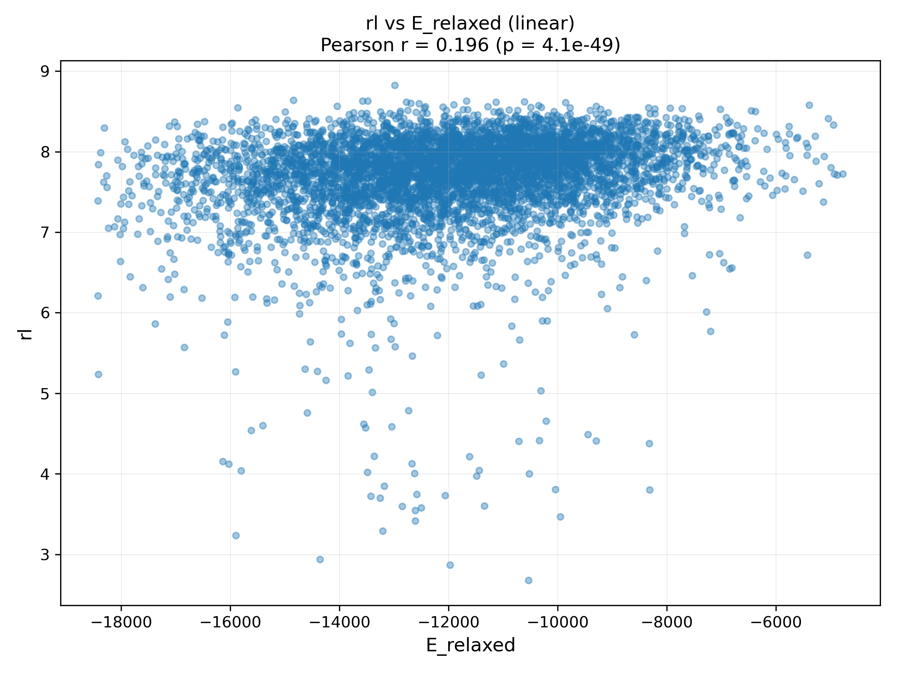

# Boltz-2 RNA Energetics Pipeline

The question I wanted to answer: **does the folded, relaxed *energy* of a 5′UTR say
anything about how efficiently it gets translated?** This pipeline puts that to the
test on the **egfp_unmod_1** dataset — fold each 5′UTR with Boltz-2, relax the
structure under a physics force field, and correlate that relaxed energy against
measured **ribosomal load** (a readout of translation efficiency).

Energetics analysis built under **Dr. Daniel Mukasa**, toward a Boltz-2-based
generative model for 5′UTR design.

> **Status:** the single correlation below is the confirmed result on this one
> dataset — stated exactly, not rounded up. Everything here is honest about being a
> first pass (one dataset, vacuum relaxation, a weak-but-real effect); see
> *Scope & caveats* at the bottom. Natural next steps: more datasets, explicit-
> solvent relaxation, and feeding this energy signal into the generative model.

## Result

On egfp_unmod_1, relaxed structural energy is a **weak but highly significant**
predictor of ribosomal load — **but only once AUG-containing 5′UTRs are excluded.**

- Across *all* sequences the relationship is effectively absent (Pearson r ≈ 0).
- Excluding 5′UTRs that contain an AUG — whose upstream start codons tend to
  dominate translation and mask any structural signal — reveals a positive
  correlation of **Pearson r = 0.196 (p = 4.1×10⁻⁴⁹, n ≈ 18k)**.

So the effect is real and directional, but small: on its own, relaxed energy
explains only a few percent of the variance in ribosomal load. The more
interesting takeaway is methodological — the relationship is invisible until you
control for AUG content, which is exactly the kind of confound a structure-energy
model has to account for.



## What it does

1. **Fold** each 5′UTR with Boltz-2 (`run_predictions.py`). Sequences are
   canonicalised T→U for Boltz, and capped at 50 nt — around the length past which
   Boltz folding reliability drops, so longer UTRs don't misfold.
2. **Clean** the predicted PDBs: strip the 5′-phosphate atoms (the OL3.RNA force
   field has no template for a phosphorylated 5′ end) and fix residue spacing.
3. **Relax** each structure in vacuum (`vacuum_150_relaxation.py`).
4. **Repair** the edited native PDBs for energy calculation
   (`repair_native_pdbs.sh`), then build prmtop/rst7 files (`make_prmtops.sh`).
5. **Compute** native vs. relaxed energies and their difference
   (`compare_energies.py`).
6. **Correlate** relaxed energy with ribosomal load (`rl_vs_e_plot.py`), excluding
   AUG-containing UTRs and removing energy outliers by the Tukey IQR rule.

## Data

**egfp_unmod_1** — eGFP 5′UTR library with polysome-profiling ribosomal load,
from GSE114002: <https://www.ncbi.nlm.nih.gov/geo/query/acc.cgi?acc=GSE114002>.
`rl_E_relaxed_pairs.csv` holds the full set of (ribosomal load, relaxed energy)
pairs produced by this pipeline.

## Run

```bash
conda env create -f environment.yml      # or: pip install -r requirements.txt (see notes)
conda activate boltz-env

python run_predictions.py --input <utrs.fasta>   # 1. fold with Boltz-2
#   (strip 5'-phosphate atoms + clean formatting on the predicted PDBs)
python vacuum_150_relaxation.py                  # 2. relax structures in vacuum
bash repair_native_pdbs.sh                       # 3. repair the edited native PDBs
bash make_prmtops.sh                             # 4. build prmtop / rst7 files
python compare_energies.py                       # 5. native vs. relaxed energies
python rl_vs_e_plot.py                           # 6. correlate energy vs ribosomal load
```

`rl_vs_e_plot.py` has path constants at the top (energy CSV, native PDB dir,
output dir) — set those for your layout before running.

## Scope & caveats

- **One dataset, one cell line.** Results are for egfp_unmod_1 only; no claim is
  made that they generalise to other UTR libraries.
- **Vacuum relaxation,** not explicit-solvent MD — a fast approximation, not a
  full free-energy estimate.
- **Correlational and weak.** r = 0.196 is a real but small effect, significant
  largely because n is large; this is a signal worth modelling, not a predictor on
  its own.
- The headline relationship **depends on excluding AUG-containing UTRs**; that
  exclusion is part of the finding, not a footnote.
